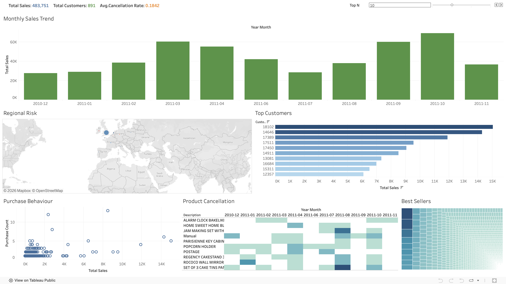

# Online-Retail-Sales-Analysis
End-to-end retail analysis: Identifying sales trends and operational risks to optimise business performance, using SQL for data transformation and Tableau for visualisation.

## Project Overview
This project focuses on building a robust analytical framework to answer: 'Why did sales change?' I leveraged SQL to process raw transactional records and built a relationship-driven Tableau dashboard. This project demonstrates the ability to take external raw data and convert it into actionable business intelligence by linking sales, customers, and risks.

## Key Objectives
- Root Cause Analysis: Identify drivers behind sales fluctuations (Customer, Product, Region) in a single view.
- Architectural Balance: Optimise performance with SQL Pre-aggregation while maintaining flexibility with Tableau Dynamic Logic.
- Actionable Insights: Provide decision support for customer retention and operational risk management.

## Tools & Technologies
- SQL (MySQL): Data cleaning, logic segregation, and pre-aggregation.
- Tableau: Relationship modeling, dynamic Top-N logic, and interactive storytelling.
- Dataset: UCI Machine Learning Repository: Online Retail (https://archive.ics.uci.edu/dataset/352/online+retail)

## Dashboard Preview
[](https://public.tableau.com/views/OnlineRetailAnalysisProject_17708374223560/Dashboard1?:language=en-GB&:sid=&:redirect=auth&:display_count=n&:origin=viz_share_link)

## Analysis Workflow
1. Data Modeling & Assumptions ("The Base Grain")
The Assumption: Treated each row as a Logical Invoice Line to handle the absence of a unique line identifier.
Logic Segregation: Separated 'Sale' vs. 'Cancellation' at the SQL level to ensure clean revenue metrics while enabling independent risk tracking.

2. Business Momentum (SQL Exploration)
Growth Metrics: Developed advanced queries for MoM (Month-over-Month) and QoQ (Quarter-over-Quarter) growth.
Unified Dimension: Integrated a YearMonth key across all tables to bridge the gap between SQL and Tableau’s relationship model.

3. Tableau Optimisation & Features
Dynamic Top-N: Used Parameters instead of static filters, allowing "Top Customers" to update in real-time based on the selected period.
Action Filters: Configured global triggers to enable Drill-down analysis—selecting a specific month on the sales trend line automatically filters all related dimensions (Customers, Products, and Countries).

## **Key Insights & Business Value**
1. Market Dominance & Strategic Expansion
- Key Insight: The United Kingdom represents over 90% of total revenue, establishing it as the primary market. However, secondary growth is visible in European countries like the Netherlands, Ireland, Germany, and France.
- Business Value: By focusing marketing spend on the high-performing UK market, the business can maximise Marketing ROI. It also helps identify new growth opportunities in emerging markets, providing a clear roadmap for expanding the business globally.

2. Seasonality & Peak Management
- Key Insight: Sales peak at their highest in October, with significant spikes in March and September, indicating strong seasonal demand in early spring and autumn.
- Business Value: Enables optimised procurement cycles to prevent stockouts during these three key peaks. It also helps in balancing inventory levels to reduce carrying costs during slower months.

3. Product Performance & Inventory Optimisation
- Key Insight: Specific steady-sellers like the 'JUMBO BAG RED RETROSPOT' drive high volume, while other premium items contribute significantly to the profit margin despite lower sales frequency.
- Business Value: This allows for ABC Inventory Analysis, prioritising high-value stock. Furthermore, implementing Product Bundling strategies (pairing high-volume items with slow-moving stock) can increase the Average Order Value (AOV) and improve inventory turnover rates.

4. Customer Identification & Retention
- Key Insight: The Top 10 customers account for a disproportionate share of total revenue, with purchasing patterns (bulk orders) that suggest they are Wholesalers rather than individual retail consumers.
- Business Value: Segmenting these high-value customers allows for a tailored CRM strategy. Establishing dedicated loyalty programs or volume-based discount tiers for these key accounts ensures long-term retention and a stable, recurring revenue base.

## Dashboard Key Features
1. Executive Summary (KPIs): Provides an immediate snapshot of Total Sales, Total Customers, and the Average Cancellation Rate.

2. Monthly Sales Trend: A bar chart visualising revenue from Dec 2010 to Nov 2011, highlighting significant performance peak in October 2011, followed by strong sales momentum in March and September.

3. Customer & Product Insights:
- Top Customers: Identifies high-value customers. Users can adjust the ranking range using the Top N Parameter at the top right.
- Best Sellers: A Treemap visualisation that clarifies which product categories contribute most to the total revenue.

4. Operational Risk Analysis:
- Regional Risk (Map): A geographical view to identify sales distribution and potential risk clusters across different countries.
- Product Cancellation (Heatmap): A heatmap tracking cancellations by product and month to identify recurring operational bottlenecks or problematic items.
- Purchase Behaviour (Scatter Plot): Analyses the correlation between total sales and purchase count to distinguish high-value customers.

## Repository Structure
```
├── Raw_Data/
│   ├── Online_Retail_Raw.xlsx
│   └── Data_Dictionary.png
├── SQL/
│   ├── 01_Data_Cleaning.sql
│   ├── 02_Data_Exploration.sql
│   └── 03_Tableau_Preparation.sql
├── Tableau/
│   ├── Online_Retail_Analysis.twbx     
│   ├── Tableau_Dashboard_Screenshot.png
│   ├── MasterFactTable.csv
│   ├── Data_Source_1.csv
│   ├── Data_Source_2.csv
│   └── Data_Source_3.csv
└── README.md                          
```
